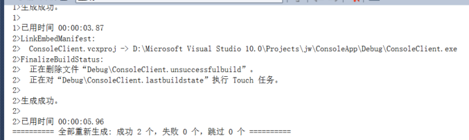
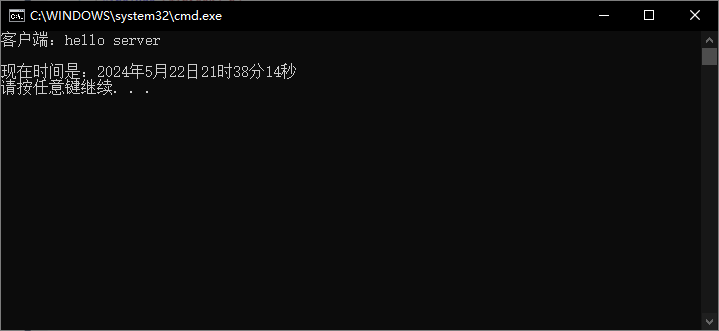
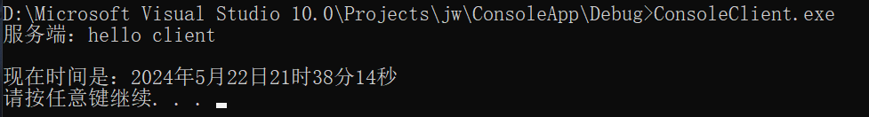

# **《计算机网络》大作业**

## **题目：简单的TCP聊天室**

## **目标：**

创建一个简单的TCP聊天室，允许多个客户端连接到服务器，并能够发送消息给其他所有客户端。

1. 

## **实现步骤：**

### ConsoleServer程序

1. **初始化Windows套接字库**：
   - 使用`WSAStartup`函数初始化Windows套接字库，指定使用的Windows Sockets规范版本。
2. **创建服务器套接字**：
   - 使用`socket`函数创建一个TCP/IP套接字，指定地址族（IPv4）、套接字类型（流套接字）、协议（TCP）。
3. **绑定套接字到本地地址和端口**：
   - 创建并初始化`sockaddr_in`结构，设置地址族、IP地址（127.0.0.1，即本地环回地址）、端口号（8888）。
   - 使用`bind`函数将套接字绑定到指定的IP地址和端口号。
4. **进入监听状态**：
   - 使用`listen`函数将套接字置于监听状态，指定连接请求队列的最大长度。
5. **接受客户端连接**：
   - 使用`accept`函数接受客户端连接请求，创建一个新的套接字用于与客户端通信。
6. **向客户端发送消息**：
   - 定义发送的消息内容。
   - 使用`send`函数向客户端发送消息。
7. **接收客户端消息**：
   - 使用`recv`函数接收来自客户端的消息，并将其存储在缓冲区中。
8. **输出客户端消息和当前时间**：
   - 输出接收到的客户端消息。
   - 使用`<ctime>`库获取并输出当前时间。
9. **关闭套接字和清理资源**：
   - 使用`closesocket`函数关闭客户端和服务器套接字。
   - 使用`WSACleanup`函数终止Windows套接字库的使用。

### ConsoleClient程序

1. **初始化Windows套接字库**：
   - 使用`WSAStartup`函数初始化Windows套接字库，指定使用的Windows Sockets规范版本。
2. **创建客户端套接字**：
   - 使用`socket`函数创建一个TCP/IP套接字，指定地址族（IPv4）、套接字类型（流套接字）、协议（TCP）。
3. **连接到服务器**：
   - 创建并初始化`sockaddr_in`结构，设置地址族、服务器IP地址（127.0.0.1，即本地环回地址）、服务器端口号（8888）。
   - 使用`connect`函数连接到服务器。
4. **接收服务器消息**：
   - 使用`recv`函数接收来自服务器的消息，并将其存储在缓冲区中。
5. **输出服务器消息和当前时间**：
   - 输出接收到的服务器消息。
   - 使用`<ctime>`库获取并输出当前时间。
6. **向服务器发送消息**：
   - 定义发送的消息内容。
   - 使用`send`函数向服务器发送消息。
7. **关闭套接字和清理资源**：
   - 使用`closesocket`函数关闭客户端套接字。
   - 使用`WSACleanup`函数终止Windows套接字库的使用。

## 实验过程：

首先生成解决方案：



在vs中运行ConsoleClient.cpp

然后在主机电脑上运行win+r，cmd进入DOS窗口

进入到D:\Microsoft Visual Studio 10.0\Projects\jw\ConsoleApp\Debug目录下

然后运行ConsoleClient.exe文件，随后输出结果，效果如下：





## **具体代码：**

### ConsoleServer.cpp代码：

```c++
#include <iostream>
#include <WinSock2.h>
#include <ctime>

#pragma comment(lib,"ws2_32.lib")        //加载ws2_32.dll
using namespace std;
//#pragma warning(suppress : 4996) //doesn't work.
#pragma warning(disable : 4996)

void printCurrentTime() {
    time_t now = time(0);
    tm* ltm = localtime(&now);
    cout << "现在时间是："
         << 1900 + ltm->tm_year << "年"
         << 1 + ltm->tm_mon << "月"
         << ltm->tm_mday << "日 "
         << ltm->tm_hour << "时"
         << ltm->tm_min << "分"
         << ltm->tm_sec << "秒" << endl;
}

int main(int argv, char* argc[])
{
    //初始化
    WSADATA wsaData;
    WSAStartup(MAKEWORD(2, 2), &wsaData);

    //创建套接字
    SOCKET servSock = socket(PF_INET, SOCK_STREAM, IPPROTO_TCP);

    //绑定套接字
    struct sockaddr_in sockAddr;
    memset(&sockAddr, 0, sizeof(sockAddr));     //每个字节用0填充
    sockAddr.sin_family = PF_INET;              //使用ipv4
    sockAddr.sin_addr.S_un.S_addr = inet_addr("127.0.0.1");
    sockAddr.sin_port = htons(8888);            //端口
    bind(servSock, (SOCKADDR*)& sockAddr, sizeof(SOCKADDR));

    //进入监听状态
    listen(servSock, 20);

    //接收客户端消息
    SOCKADDR clntAddr;
    int nSize = sizeof(SOCKADDR);
    SOCKET clntSock = accept(servSock, (SOCKADDR*)& clntAddr, &nSize);

    //向客户端发送消息
    const char* str = "hello client\r\n";
    send(clntSock, str, strlen(str) + 2 * sizeof(char), NULL);
    //printCurrentTime(); // 输出当前时间

    char szBuffer[MAXBYTE] = { 0 };
    recv(clntSock, szBuffer, MAXBYTE, NULL);
    cout << "客户端：" << szBuffer << endl;
    printCurrentTime(); // 输出当前时间

    //关闭套接字
    closesocket(clntSock);
    closesocket(servSock);

    //终止dll使用
    WSACleanup();

    system("pause");
    return 0;
}
```

### ConsoleClient.cpp程序：

```c++
#include <iostream>
#include <WinSock2.h>
#include <ctime>

#pragma comment(lib,"ws2_32.lib")
//#pragma warning(suppress : 4996) //doesn't work.
#pragma warning(disable : 4996)
using namespace std;

void printCurrentTime() {
    time_t now = time(0);
    tm* ltm = localtime(&now);
    cout << "现在时间是："
         << 1900 + ltm->tm_year << "年"
         << 1 + ltm->tm_mon << "月"
         << ltm->tm_mday << "日 "
         << ltm->tm_hour << "时"
         << ltm->tm_min << "分"
         << ltm->tm_sec << "秒" << endl;
}

int main(int argv, char* argc[])
{
    //初始化
    WSADATA wsaData;
    WSAStartup(MAKEWORD(2, 2), &wsaData);

    //创建套接字
    SOCKET clntSock = socket(PF_INET, SOCK_STREAM, IPPROTO_TCP);

    //向服务器发送消息
    sockaddr_in sockAddr;
    memset(&sockAddr, 0, sizeof(sockAddr));         //每个字节都用0填充
    sockAddr.sin_family = PF_INET;
    sockAddr.sin_addr.S_un.S_addr = inet_addr("127.0.0.1");
    sockAddr.sin_port = htons(8888);
    connect(clntSock, (SOCKADDR*)& sockAddr, sizeof(SOCKADDR));

    //接收服务器消息
    char szBuffer[MAXBYTE] = { 0 };
    recv(clntSock, szBuffer, MAXBYTE, NULL);

    //输出接收到的数据
    cout << "服务端：" << szBuffer << endl;
    printCurrentTime(); // 输出当前时间

    //向服务端发送消息
    const char* str = "hello server\r\n";
    send(clntSock, str, strlen(str) + 2 * sizeof(char), NULL);

    //关闭套接字
    closesocket(clntSock);

    //终止dll
    WSACleanup();

    system("pause");

    return 0;
}
```

